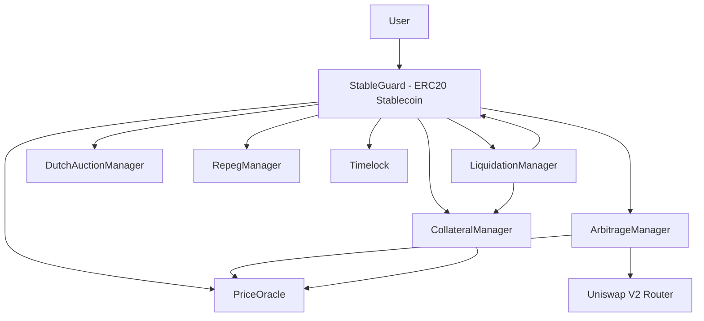
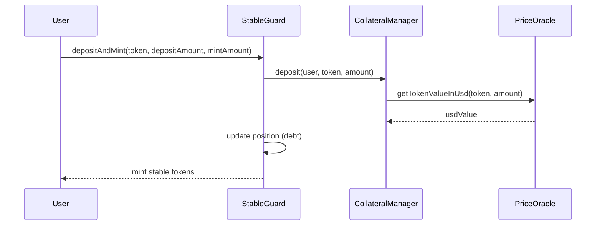
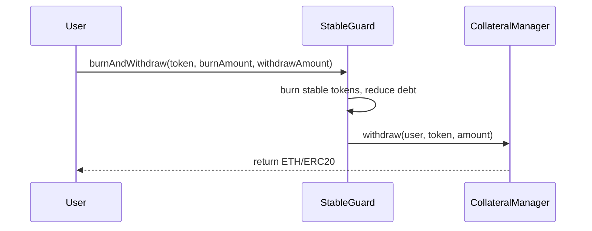
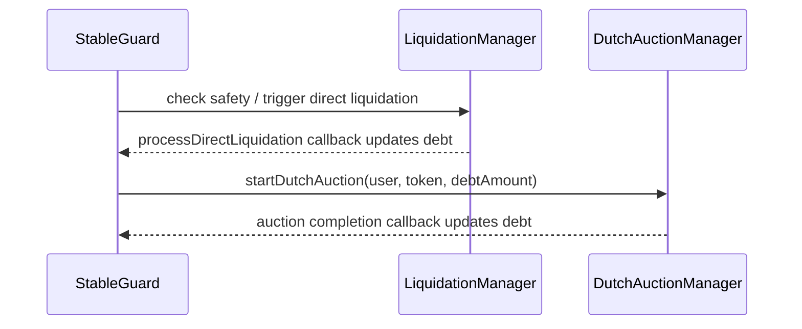
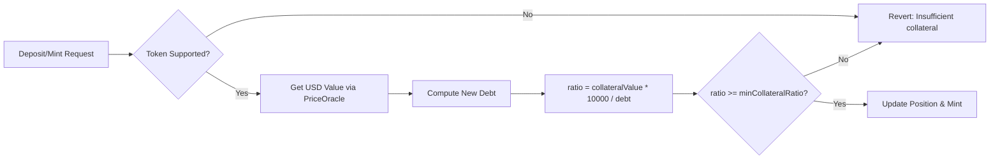
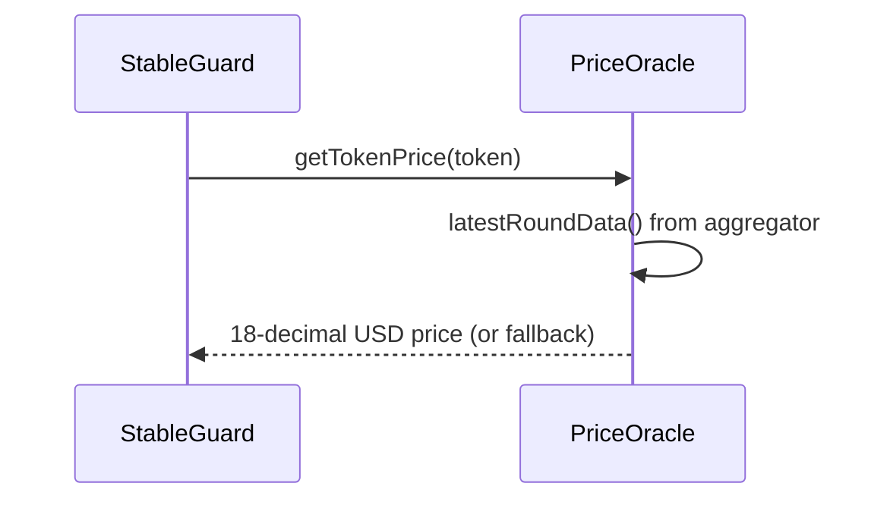
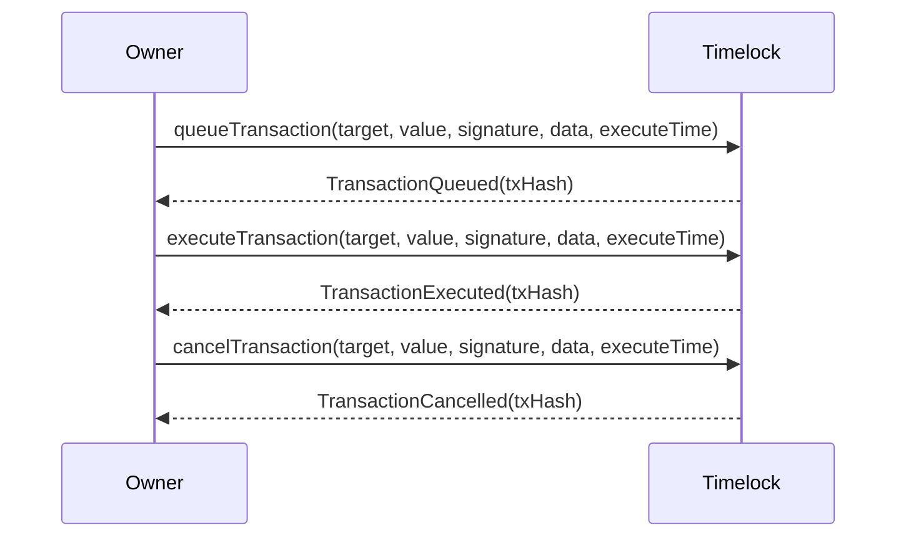
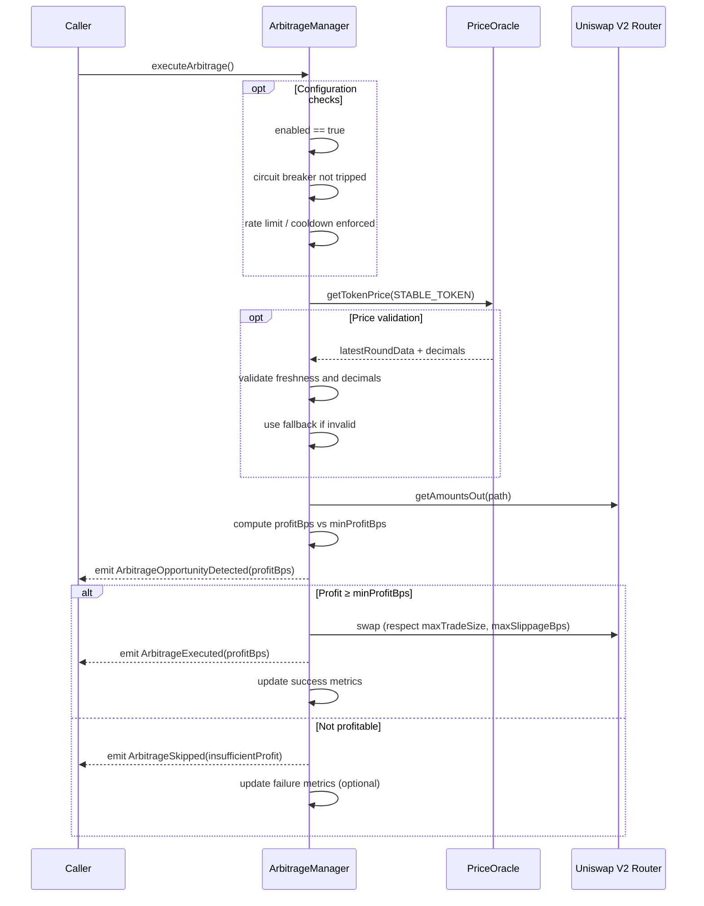
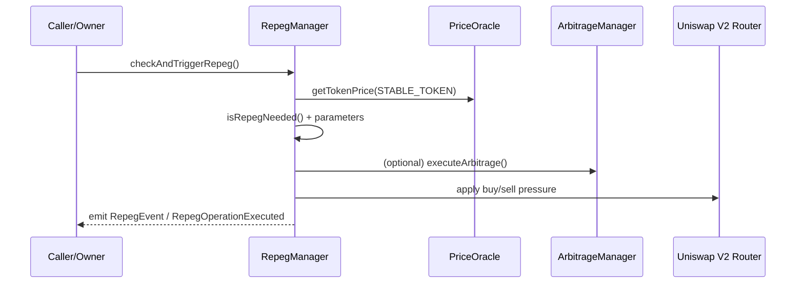
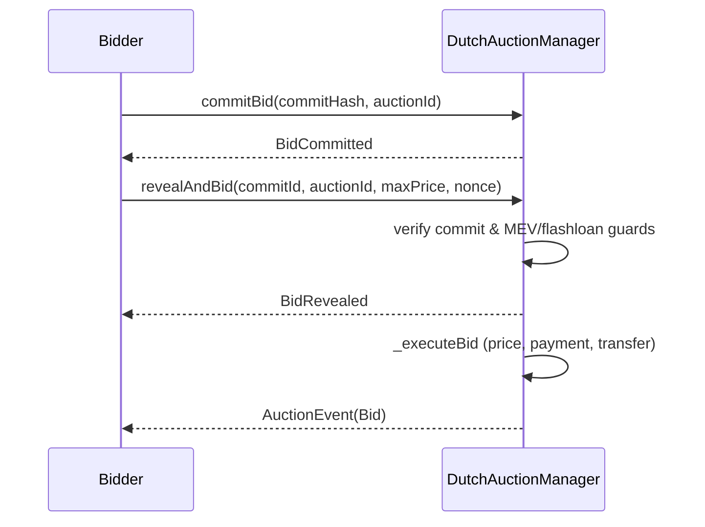

# StableGuard — Gas‑Optimized Modular Stablecoin Protocol

StableGuard is a research‑grade, modular stablecoin system designed to demonstrate production‑style architecture, gas optimizations, and robust safety checks without requiring mainnet deployment. It includes an on‑chain price oracle with fallback logic, collateral accounting, liquidation via direct and Dutch auction flows, and optional arbitrage/repeg modules. The Repeg module continuously monitors deviation from the target price and applies bounded buy/sell pressure (optionally coordinating with arbitrage) under slippage and size guards to realign the peg; thresholds, cooldowns, and circuit‑breakers prevent oscillations and abuse. Dutch auctions complement direct liquidation by discovering a market‑clearing price with a decaying curve and commit‑reveal flow, reducing MEV and manipulation compared to fixed‑bonus burns while settling unsafe positions under stress.

> Portfolio‑friendly: runs locally with mocks; no fork or deployment required. ETH is represented as `address(0)` for native flows and is supported directly by the oracle in this repository.

## Table of Contents

- [Overview](#overview)
- [Why It Matters](#why-it-matters)
- [At a Glance](#at-a-glance)
- [Non‑Production Scope](#non-production-scope)
- [Architecture](#architecture)
- [Modules](#modules)
- [Functional Scope](#functional-scope)
- [Key Flows](#key-flows)
  - [Deposit & Mint](#deposit--mint)
  - [Burn & Withdraw](#burn--withdraw)
  - [Liquidation (Direct & Auction)](#liquidation-direct--auction)
  - [Arbitrage & Repeg](#arbitrage--repeg)
- [Flows: Deep Dive](#flows-deep-dive)
  - [Collateralization & Safety](#collateralization--safety)
  - [Oracle Price Path](#oracle-price-path)
  - [Liquidation Paths](#liquidation-paths)
  - [Timelock Flow](#timelock-flow)
  - [Arbitrage Flow](#arbitrage-flow)
  - [Repeg Flow](#repeg-flow)
  - [Dutch Auction (Commit-Reveal) Flow](#dutch-auction-commit-reveal-flow)
- [Security & Safety](#security--safety)
  - [Security Aspects](#security-aspects)
    - [Access Control](#access-control)
    - [Validation](#validation)
    - [Reentrancy Protection](#reentrancy-protection)
    - [Rate Limiting](#rate-limiting)
    - [Timelock](#timelock)
    - [Oracle Safety](#oracle-safety)
    - [MEV Protections](#mev-protections)
  - [Security by Module](#security-by-module)
- [Protocol Invariants](#protocol-invariants)
- [Risk Model & Parameters](#risk-model--parameters)
  - [Parameters Cheat Sheet](#parameters-cheat-sheet)
- [Design Decisions](#design-decisions)
- [Events & Telemetry](#events--telemetry)
  - [Flow Mapping](#flow-mapping)
- [Performance Notes](#performance-notes)
- [Repository Structure](#repository-structure)
- [Getting Started](#getting-started)
  - [Prerequisites](#prerequisites)
  - [Dependencies](#dependencies)
  - [Install & Build](#install--build)
    - [Quick Start](#quick-start)
  - [Tooling & Formatting](#tooling--formatting)
  - [Troubleshooting](#troubleshooting)
- [Running Tests](#running-tests)
  - [Test Coverage Summary](#test-coverage-summary)
- [Development Notes](#development-notes)
  - [Assumptions & Normalization](#assumptions--normalization)
- [Limitations & Roadmap](#limitations--roadmap)
- [Threats & Mitigations](#threats--mitigations)
- [Production Hardening Checklist](#production-hardening-checklist)
- [Glossary](#glossary)

## Overview

StableGuard is an ERC20‑based stable token backed by user collateral. The system focuses on:

- Gas‑efficient storage packing and assembly in critical paths.
- Clear access controls and rate limiting.
- Deterministic local testing with Chainlink‑style mocks.
- Extensible modules for liquidation (direct + Dutch auction), arbitrage, and repeg.

## Why It Matters

- Realistic architecture: mirrors production patterns (owner controls, timelock, module wiring) without external dependencies.
- Robust pricing: integrates an oracle with validated feeds, fallback prices, and decimal normalization.
- Safety by design: strict validation (addresses, ratios, thresholds), non‑reentrancy, and permissioned operations.
- Demonstrates advanced patterns: packed structs, low‑level assembly guards, and MEV‑aware auctions.

## At a Glance

- `StableGuard`: core ERC20 stable, orchestrates mint/burn and enforces ratios.
- `PriceOracle`: validated price feeds, fallback prices, 18‑dec normalization.
- `CollateralManager`: deposit/withdraw, per‑token LTV and thresholds.
- `LiquidationManager`: direct liquidation with security caps and validations.
- `DutchAuctionManager`: commit‑reveal auctions, descending price curve, MEV guards.
- `RepegManager`: bounded buy/sell pressure to re‑align peg with safeguards.
- `ArbitrageManager`: detects on‑chain price dislocations and coordinates execution.
- `Timelock`: delays sensitive owner actions; queue/execute/cancel lifecycle.

## Non‑Production Scope

- Portfolio/demo focus: local mocks, no forks or deployments, no external infra.
- Missing mainnet hardening: governance/multisig, redundant oracles, audits, monitoring.
- Parameters are illustrative: tune thresholds, cooldowns, and limits per risk appetite.
- Use this as a learning/prototyping base, not a production deployment.

## Architecture



### High‑Level Responsibilities

- `StableGuard`: core token, orchestrates deposit/mint, burn/withdraw, calls liquidation/auction managers.
- `PriceOracle`: validated price retrieval via aggregator feeds, fallback prices, and decimal handling.
- `CollateralManager`: per‑user collateral tracking, ETH and ERC20 handling, controlled by StableGuard.
- `LiquidationManager`: checks safety, performs emergency/direct liquidation; notifies StableGuard.
- `DutchAuctionManager`: MEV‑aware auction flow to sell collateral against debt.
- `ArbitrageManager`: detects and executes arbitrage using DEX prices vs oracle.
- `RepegManager`: monitors deviation and manages repeg operations (configurable).
- `Timelock`: delayed execution for emergency operations.

## Modules

- StableGuard (`src/StableGuard.sol`)
- PriceOracle (`src/PriceOracle.sol`)
- CollateralManager (`src/CollateralManager.sol`)
- LiquidationManager (`src/LiquidationManager.sol`)
- DutchAuctionManager (`src/DutchAuctionManager.sol`)
- ArbitrageManager (`src/ArbitrageManager.sol`)
- RepegManager (`src/RepegManager.sol`)
- Timelock (`src/Timelock.sol`)

Interfaces live under `src/interfaces`. Tests use internal local mocks for deterministic behavior.

## Functional Scope

- Collateralized stablecoin with native ETH (`address(0)`) and ERC20 support.
- End-to-end mint/burn flows with oracle-backed USD valuation.
- Liquidation via direct and Dutch auction paths with safety checks.
- Repeg and arbitrage utilities to manage peg deviations.
- Timelock for delayed, owner-gated emergency operations.
- Rate limiting for user/global operations to resist abuse.

## Key Flows

### Deposit & Mint



### Burn & Withdraw



### Liquidation (Direct & Auction)



### Arbitrage & Repeg

- Arbitrage checks oracle vs DEX prices; executes when profitable within slippage/limit guards.
- RepegManager monitors deviation and triggers operations based on configured thresholds/cooldowns.

## Flows: Deep Dive

### Collateralization & Safety



- Safety checks compare the collateralization ratio against `config.minCollateralRatio` (basis points).
- Liquidation safety compares against `config.liquidationThreshold`.

### Oracle Price Path



- Validates aggregator data (round, answer, freshness) and decimals.
- Falls back to `fallbackPrice` if Chainlink data invalid; emits telemetry events.

### Liquidation Paths

- Direct liquidation burns debt and transfers required collateral + bonus.
- Auction liquidation triggers `DutchAuctionManager.startDutchAuction` and settles via callbacks.

### Timelock Flow



### Arbitrage Flow



### Repeg Flow



### Dutch Auction (Commit‑Reveal) Flow



## Security & Safety

- Access control: `onlyOwner`, `onlyStableGuard`, `onlyAuth` and module‑specific modifiers.
- Validation: non‑zero addresses, duplicate module prevention, bounds for ratios and penalties.
- Reentrancy protection: `ReentrancyGuard` used across core modules.
- Rate limiting: user/global operation caps, cooldowns, and windows in StableGuard.
- Timelock: delayed execution for sensitive owner actions.
- Oracle safety: freshness checks, deviation limits, fallback prices, validated feeds.

### Security Aspects

#### Access Control
- Owner‑gated admin, `onlyStableGuard` for core flows, and module‑specific auth ensure least privilege.

#### Validation
- Strict bounds for ratios/penalties, non‑zero addresses, duplicate‑module prevention, and per‑token sanity checks.

#### Reentrancy Protection
- Non‑reentrancy across state‑mutating paths; ETH/ERC20 flows guarded to prevent reentrancy vectors.

#### Rate Limiting
- Per‑user and global windows, cooldowns, and burst caps constrain throughput and mitigate spam/MEV griefing.

#### Timelock
- Sensitive operations require delay and explicit queue/execute; cancellations enforce safety under uncertainty.

#### Oracle Safety
- Max age/heartbeat, deviation limits, validated fallbacks, and decimal normalization reduce price‑path risks.

#### MEV Protections
- Commit‑reveal in auctions, flashloan checks, block caps, and price‑impact guards reduce manipulation and sniping.

### Security by Module

- StableGuard
  - Access: `onlyOwner`, `validModules`; non‑reentrancy on core flows.
  - Safety: collateral ratio checks (`minCollateralRatio`, `liquidationThreshold`).
  - Rate limiting: user/global windows, cooldowns, burst caps; events for exceed/updates.
  - Admin: atomic `updateModules` with duplicate address prevention; config bounds.
  - ETH handling: receive ETH for forwards; forwards tokens/ETH after withdrawals.

- CollateralManager
  - Access: `onlyAuth` (owner or guard), `onlyStableGuard` for deposit/withdraw.
  - Validation: `validAmount`, `validUser`, oracle token support.
  - Reentrancy: guarded; ETH requires `msg.value == amount`; ERC20 via transfers.
  - Admin: `addCollateralType` bounds; `emergencyWithdraw` owner‑only; restricted `receive()`.

- PriceOracle
  - Access: owner‑only configuration; `validToken` gating for queries.
  - Freshness: max age/heartbeat/grace; strict/normal modes; deviation checks.
  - Fallbacks: validated fallback price; events on fallback/use/updates.
  - Decimals: enforce `0 < decimals <= 18`; normalize to 18 decimals.

- LiquidationManager
  - Access: `onlyOwner` admin; `onlyGuard` operational; `setStableGuard` owner‑only.
  - MEV protections: rate limiting, block caps, flashloan detection, price deviation validation.
  - Safety: collateral checks, optimal token selection, threshold comparisons.

- DutchAuctionManager
  - Access: `onlyOwner`, `onlyStableGuard`; per‑auction validation.
  - MEV protections: commit‑reveal, minimum bid delay, flashloan checks, price impact caps.
  - State: expiry handling, batch cleaning with incentives; non‑reentrancy on bid flows.

- RepegManager
  - Access: `onlyAuthorized` (owner or StableGuard); emergency pause; circuit breaker.
  - Liquidity: provider tracking, reserves, minimum liquidity checks.
  - Safety: config validation (thresholds, cooldowns, windows), cached prices, adaptive thresholds.

- Timelock
  - Access: `onlyOwner`; delay bounds; queue/execute/cancel lifecycle.
  - Safety: grace period enforcement; non‑reentrancy on execute.

## Protocol Invariants

- Only the configured `StableGuard` can call `CollateralManager.deposit/withdraw`.
- PriceOracle returns 18-decimal USD prices; decimals > 0 and ≤ 18.
- `configureToken`: `priceFeed != address(0)`, `fallbackPrice > 0`, owner-only.
- ETH is supported as `address(0)` when configured in PriceOracle; CollateralManager enforces `msg.value` for ETH.
- Collateralization ratio must always satisfy `minCollateralRatio` for mint operations.
- Liquidation triggers require position unsafe against `liquidationThreshold`.

## Risk Model & Parameters

- StableGuard `PackedConfig` (basis points):
  - `minCollateralRatio` (e.g., 15000 = 150%).
  - `liquidationThreshold` (e.g., 12000 = 120%).
  - `emergencyThreshold`.
- CollateralManager `CollateralType` (per-token):
  - `ltv`, `liquidationThreshold`, `liquidationPenalty` (basis points).
  - `decimals`, `priceFeed`, `fallbackPrice`.
- Safety checks:
  - `ratio = collateralValue * 10000 / debt`.
  - Safe if `ratio >= minCollateralRatio`.
  - Liquidation if `collateralValue * 10000 < debt * liquidationThreshold`.

- LiquidationManager `PackedConfig`:
  - `minRatio`, `liqThreshold`, `bonus` (basis points) and `stableGuard`.
  - MEV & security: `MIN_LIQUIDATION_DELAY`, `MAX_LIQUIDATIONS_PER_BLOCK`, `FLASHLOAN_PROTECTION_BLOCKS`, `MAX_PRICE_DEVIATION`.

- DutchAuctionManager `Config`:
  - `duration`, `minPriceFactor`, `liquidationBonus`.
  - MEV & security: `COMMIT_DURATION`, `REVEAL_DURATION`, `MIN_BID_DELAY`, `MAX_PRICE_IMPACT`, `FLASHLOAN_PROTECTION_BLOCKS`.

### Parameters Cheat Sheet

- Collateralization:
  - `minCollateralRatio`: ≥ 150% recommended for conservative setups.
  - `liquidationThreshold`: 120%–140% depending on asset volatility.
  - `liquidationPenalty`: 5%–20% to incentivize liquidators without excess.
- Oracle:
  - `maxAge/heartbeat`: 30s–5m for liquid assets; stricter under stress.
  - `maxDeviation`: 1%–3% vs previous price; tighter for stable assets.
- Repeg:
  - `deviationThreshold`: 0.1%–0.5%; `cooldown`: minutes; size caps per window.
  - `slippageTolerance`: 0.5%–1% depending on DEX liquidity.
- Rate limits:
  - Per‑user/global caps tuned to expected throughput; enforce cooldowns.
- Auctions:
  - `commit/reveal` durations: tens of seconds to minutes; `minBidDelay` ≥ 1 block.
- Timelock:
  - Delay: hours to days; longer for governance‑level operations.

- RepegManager `RepegConfig`:
  - `targetPrice`, `deviationThreshold`, `repegCooldown`, `arbitrageWindow`, `incentiveRate`, `maxRepegPerDay`, `enabled`.
  - Limits: `MAX_DEVIATION`, `MAX_INCENTIVE`.

- ArbitrageManager `ArbitrageConfig`:
  - `maxTradeSize`, `minProfitBps`, `maxSlippageBps`, `enabled`.
  - Security: circuit breaker thresholds (`FAILURE_THRESHOLD`, `RECOVERY_TIME`), gas limits (`MAX_EXTERNAL_CALL_GAS`, `MAX_SWAP_GAS`), rate limiting (`OPERATION_COOLDOWN`).

- Timelock:
  - `MINIMUM_DELAY`, `MAXIMUM_DELAY`, `GRACE_PERIOD` for delayed execution.

## Design Decisions

- ETH as `address(0)`: In this repository, native ETH is represented by `Constants.ETH_TOKEN = address(0)`. The `PriceOracle` explicitly supports `address(0)` for ETH with a valid feed and fallback price.
  - Owner‑only configuration; `priceFeed != address(0)`; `fallbackPrice > 0`; `decimals > 0`.
  - Tests reflect this behavior (configuring `address(0)` is valid; invalid feeds/prices still revert).
- Modular wiring: StableGuard holds module references and updates them atomically with duplication checks.
- Deterministic testing: Chainlink feed mocked via `MockAggregatorV3`; no external RPC or fork needed.

## Events & Telemetry

### Flow Mapping

- Peg monitoring: detect deviation → emit opportunity event → (optional) arbitrage call → repeg execution.
- Liquidation: unsafe position detection → direct or auction path → execution and settlement events.
- Auctions: start → bids committed → bids revealed → winning execution → finalization.
- Safety: rate limit exceeded/updated, oracle fallback used, config updates tracked for dashboards.

 - PriceOracle: `TokenConfigured`, `PriceUpdated`, `FallbackPriceUsed`, `FallbackPriceUpdated`, `FreshnessConfigUpdated`, `PriceDeviationDetected`, `StaleDataDetected`.
 - StableGuard: `PositionUpdated`, `PositionLiquidated`, `LiquidationTriggered`, `ModulesUpdated`, `RateLimitExceeded`, `RateLimitUpdated`, `GlobalRateLimitExceeded`, `RateLimitingPauseChanged`, `RepegMonitoring`, `RepegConfigUpdated`, `RepegLiquidityOperation`.
 - CollateralManager: `Deposit`, `Withdraw`.
 - LiquidationManager: `LiquidationEvent`, `MEVAttemptDetected`, `FlashloanDetected`, `RateLimitExceeded`.
 - DutchAuctionManager: `AuctionEvent`, `BidCommitted`, `BidRevealed`, `MEVAttemptDetected`, `FlashloanDetected`.
 - ArbitrageManager: `ArbitrageExecuted`, `ArbitrageOpportunityDetected`, `ConfigUpdated`.
 - RepegManager: `RepegEvent`, `ArbitrageExecuted`, `RepegOperationExecuted`, `BuyPressureExecuted`, `SellPressureExecuted`.
 - Timelock: `TransactionQueued`, `TransactionExecuted`, `TransactionCancelled`, `DelayChanged`.

## Performance Notes

- Packed storage structs (`UserPosition`, `PackedConfig`, `PackedModules`).
- Inline assembly for critical updates and ratio calculations.
- Batched operations: `batchDepositAndMint`, `batchBurnAndWithdraw`.
- Caching of collateral values with short-lived cache window.
- Gas-aware external call patterns and minimized storage writes.

## Repository Structure

```
backend/
├─ src/
│  ├─ StableGuard.sol
│  ├─ PriceOracle.sol
│  ├─ CollateralManager.sol
│  ├─ LiquidationManager.sol
│  ├─ DutchAuctionManager.sol
│  ├─ ArbitrageManager.sol
│  ├─ RepegManager.sol
│  ├─ Timelock.sol
│  ├─ interfaces/
│  │  ├─ IPriceOracle.sol, ILiquidationManager.sol, ...
├─ test/
│  ├─ PriceOracle.t.sol
│  ├─ StableGuard.t.sol
│  ├─ CollateralManager.t.sol
│  ├─ LiquidationManager.t.sol
│  ├─ DutchAuctionManager.t.sol
│  ├─ ArbitrageManager.t.sol
│  ├─ RepegManager.t.sol
│  └─ Timelock.t.sol
├─ lib/
│  ├─ forge-std
│  └─ openzeppelin-contracts
├─ foundry.toml
└─ README.md
```

## Getting Started

### Prerequisites

- Foundry toolchain (`forge`, `cast`): https://book.getfoundry.sh/getting-started/installation
- Git

### Dependencies

Dependencies are managed with Foundry and installed into `lib/` when developing locally:

- `forge-std` (Foundry standard library)
- `openzeppelin-contracts`

Install after cloning:

```bash
forge install foundry-rs/forge-std
forge install OpenZeppelin/openzeppelin-contracts
```

Notes:
- Versions are pinned in `foundry.lock`; `forge install` respects these pins.
- `lib/` is not committed; collaborators should run `forge install` after cloning.

### Install & Build

- Clone the repository.
- Build the contracts:

```bash
forge build
```

#### Quick Start

```bash
# 1) Initialize Git (required by forge install)
git init

# 2) Install dependencies into lib/
forge install foundry-rs/forge-std
forge install OpenZeppelin/openzeppelin-contracts

# 3) Build and run tests
forge build
forge test -vv
```

### Tooling & Formatting

- Recommended: latest stable Foundry; if versions diverge, update to current release.
- Format code with `forge fmt` to keep consistent style.
- If artifacts look stale, run `forge clean` before building/testing.

### Troubleshooting

- Error: `fatal: not a git repository` when running `forge install`.
  - Fix: run `git init` at the project root and retry `forge install`.
- Stale artifacts or cache.
  - Fix: `forge clean && forge build`.
- Remappings not found.
  - Fix: check `foundry.toml` (uses `@openzeppelin/contracts/=lib/openzeppelin-contracts/contracts/`) and run `forge remappings` to inspect.
- Forge-only flow (no submodules) but `.gitmodules` shows up.
  - Fix: remove `.gitmodules` and ensure `lib/` is listed in `.gitignore`.

 

## Running Tests

- Run all tests with verbose output:

```bash
forge test -vv
```

- Run a single test file:

```bash
forge test -vv -m PriceOracle
forge test -vv --match-path test/StableGuard.t.sol
```

- Focus a specific test case:

```bash
forge test -vvv -m testInvalidConfigurations
```

Notes:

- Tests include internal mocks in test files for deterministic pricing.
- No environment variables or RPC endpoints are required.
 - Optional: include gas report output

```bash
forge test --gas-report
```

### Test Coverage Summary

- Unit tests cover core modules (StableGuard, CollateralManager, PriceOracle, Liquidation, DutchAuction, Repeg, Timelock).
- Deterministic mocks provide stable oracle and token behaviors; no RPC/env required.
- Invariants focus on collateralization, access control, timelock semantics, and auction correctness.
- Gas report highlights packed storage, batched operations, and cache usage in hot paths.

## Development Notes

- Owner & initialization: setters like `setStableGuard` on managers are owner‑gated; StableGuard updates module references via `updateModules`.
- Ratios & thresholds: validated to sensible bounds (e.g., min collateral ratio ≥ 110%).
- Decimals & price normalization: oracle converts aggregator answers to 18‑decimals USD values.
- ETH vs ERC20: CollateralManager enforces `msg.value` for ETH and transfers for ERC20.

### Assumptions & Normalization

- Prices normalized to 18 decimals (USD) for arithmetic consistency across tokens.
- ETH is represented as `address(0)` in flows where native value is supported.
- Rounding follows conservative bias in ratio checks to avoid over‑minting.

## Limitations & Roadmap

- Portfolio focus: local mocks only; no deployment, fork, or live feeds.
- Oracle scope: designed for demo; extend with more feeds and resilience if taken to production.
- Auction realism: Dutch auction parameters are simplified for clarity.
- Potential future work:
  - Formal verification / property tests.
  - Advanced MEV protections.
  - Multi‑asset risk parameters and dynamic LTV.

## Threats & Mitigations

- Price manipulation (oracle/DEX): mitigated via freshness/deviation checks, validated fallbacks.
- MEV/sniping in auctions: commit‑reveal, bid delays, price‑impact caps.
- Reentrancy/unauthorized access: guards on state paths, strict `only*` modifiers.
- Rate‑based DoS: per‑user/global limits, cooldowns, and windows.
- Configuration hazards: timelocked admin, bounds validation, circuit breakers.

## Production Hardening Checklist

- Governance: multisig owner, audited timelock with enforced delays.
- Oracles: redundant feeds, cross‑validation, failure modes tested.
- Parameters: dynamic limits based on volatility; on‑chain circuit breakers.
- Monitoring: off‑chain telemetry, alerts for deviation, rate‑limit hits, auction states.
- Testing: extended property/invariant suites, fuzzing, and formal verification where applicable.

## Glossary

- Peg: target price the stable aims to maintain.
- Slippage: execution price movement due to trade size/liquidity.
- Circuit breaker: emergency pause or threshold‑based halt.
- Commit‑reveal: two‑phase bidding to hide intent and reduce MEV.
- MEV: extractable value from transaction ordering/manipulation.
- LTV: loan‑to‑value; collateralization ratio in basis points.
- Heartbeat: expected max age for a price update in the oracle.
- Fallback price: validated backup when primary feed is unavailable.